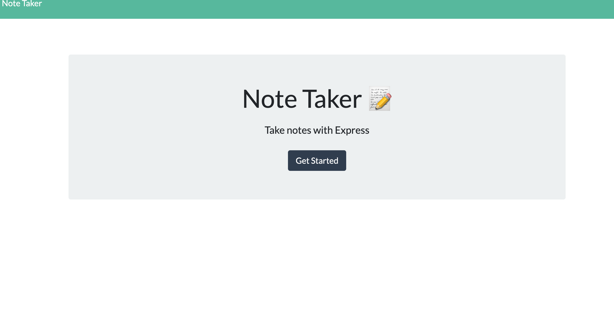

Note Taker

Description

This is a note taking  application. This app can be used to write and same notes. This application uses an express backedn and save and retrieve note data from a file. 

Technology used

JavaScript
NodeJS
Node Packages:
Express

Installing information 

Clone the repository to your local development environment.

git clone https://github.com/Menuka786/gwHomework11.git

Navigate to the developer-profile-generator folder using the command prompt.

Run npm install to install all dependencies. To use the application locally, run node server.js in your CLI, and then open http://localhost:3000 in your preferred browser. The Note Taker app is live on Heroku for you to use as well.

Preview

![screen shot] (notetaker2.png)

